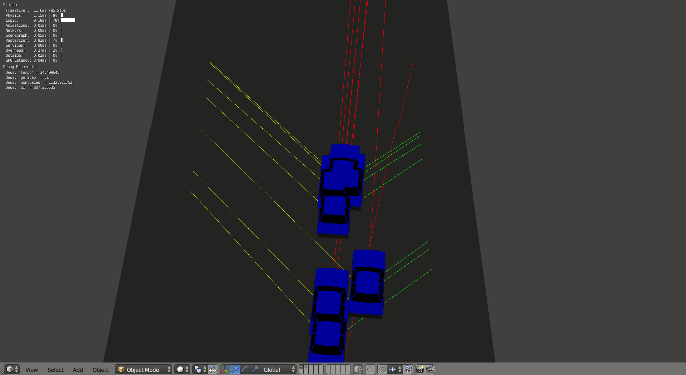

# Carros com algoritmo genético em Blender

## Indice

<!--Adiconar depois utilizando o [site](https://ecotrust-canada.github.io/markdown-toc/)-->
- [Introdução](#introducao)
- [Como funciona](#como-funciona)
- [Pistas](#pistas)
- [Algoritmo genetico](#algoritmo-genetico)
- [Pontuação](#pontuacao)
- [Requisitos](#requisitos)
- [Uso](#uso)
- [Trabalhos Futuros](#trabalhos-futuros)

## Introducao

Esse é um projeto desenvolvido para a disciplina PSI 3572- Computação Visual, dada pela Escola Politécnica da USP no segundo semestre de 2019. O projeto consiste em desenvolver uma aplicação que utilize computação. Nós escolhemos utilizar um algoritmo genético para ensinar um carro virtual a dirigir.

Aplicacoes semelhantes podem ser encontradas na Internet, como nesse [link](https://ashwinvaidya.com/blog/self-driving-car-using-genetic-algorithm-in-unity/) ou [aqui](https://www.youtube.com/watch?v=8V2sX9BhAW8&feature=emb_title). Porem, nao conseguimos achar nenhum programa desse tipo que rode utilizando a Blender Game Engine. Logo, resolvemos fazer um. Outro motivo para utilizarmos o Blender, é por ser mais leve para rodar do que o Unity e também por ser um programa Open Source.

Os resultados podem ser vistos no [video](https://youtu.be/K3c_hVrH8Zo)

## Como funciona 
Para aplicarmos um algoritmo genético, pensamos em utilizar um controlador genérico no carro e então o algoritmo genético altera os parâmetros desse controlador, dando assim características diferentes aos carros para serem selecionados. O controlador do algoritmo genético pode ser encontrados nos scripts "gerador_logic.py".

Como controlador, resolvemos utilizar uma rede neural, e assim, os parâmetros que constituem o código genético dos carros são os pesos e vieses da rede. A estrutura interna da rede é diferente no gerador 1 e no gerador 2, mais detalhes podem ser encontrados dentro dos readme dessas pastas. Apesar disso, as entradas e saídas da rede são iguais para ambos. As entradas são o módulo da velocidade linear do carro e o valor de 3 sensores do tipo Ray(Exemplificados por "lasers" na visualização). A saída é o equivalente as teclas WASD do teclado, para controlar o carrinho. O código relacionado ao controlador do carrinho pode ser encontrado nos scripts "network_logic.py".



O modelo fisico do carrinho foi adaptado desse [modelo](https://free3d.com/3d-model/low-poly-car-40967.html) encontrado na internet. Para animar o carrinho, primeiramente fizemos um script "car_logic.py", que permitia ao usuario controlar o carrinho de forma mais natural utilizando as teclas WASD do teclado. Após isso, bastou trocar essa entrada do teclado pela saída da rede neural.

Há ainda mais um arquivo não explicado, o 'cube_logic.py'. Esse arquivo apenas move um cubo responsável pelo posicionamento correto dos sensores tipo Ray.

Os carros de cada geração correm todos ao mesmo tempo, porém são essencialmente invisíveis uns aos outros, já que não colidem uns com os outros e os sensores detectam apenas a distância da pista.

## Pistas
Para treinarmos o carrinho, precisávamos de uma pista de teste, para isso, utilizamos como inspiração autódromos de Fórmula 1. Primeiramente criamos uma seção lateral da pista com muros dos lados, como no arquivo "pista_pedaco.blend". Depois, é possível fazer a pista seguir uma curva determinada como nesse [video](https://www.youtube.com/watch?v=SDLLbKvEeBY). Para criar a curva utilizamos a biblioteca Shapely do python, que permite criar uma curva a partir de uma série de pontos. Essa biblioteca também foi útil para calcularmos a distância percorrida sobre essa curva. Como no vídeo, projetamos um desenho esquemático da pista de Interlagos, que serviu como treinamento, e fomos manualmente achando as coordenadas corretas para aproximar essa pista. Esse processo está no arquivo "pistaInterlagos.blend".

Após treinado o carrinho , fizemos uma pista com o desenho da pista de mônaco da Fórmula 1, para testá-los em uma pista diferente e ver como eles funcionavam.

Importante notar, que devido a forma que construímos a pista, desconsideramos as diferenças de altitude entre os setores da pista. Logo uma pista com ladeiras passa a ser uma pista plana.


## Algoritmo genetico
O Algoritmo genetico, que está descrito em "gerador_logic.py" funciona da seguinte maneira. O código genético é um array que possui os pesos e vieses da rede neural que constitue o carro. Na primeira geração, são criados carros com os genes iniciados aleatoriamente. 

No gerador 2, durante o teste de uma geração, conforme os carros vão falhando, seus códigos genéticos são incluídos em uma lista, assim como as suas pontuações são incluídas em outra lista. Após todos os carros falharem, ou conseguirem chegar ao final da pista(e consequentemente falhar, pois irão ficar parados por muito tempo), são unidos a lista de genes e a lista de pontuações de forma a criar uma tabela(ou matriz) que contém em cada linha o código genético do carro e a sua pontuação. Essa matriz é então ordenada de acordo com a pontuação de forma que a pontuação mais alta fique no topo da matriz. Assim, passa-se essa matriz para uma função de reprodução

No gerador 1, a matriz com os genes e as pontuacoes é gerada somente após passado um determinado tempo de simulação, já que todos os carros sempre estão na pista.

Na fase de reprodução, são selecionados os x primeiros indivíduos para serem reproduzidos. Então, é gerado pares de reprodução, de forma que o primeiro tenha prioridade na reprodução, o segundo após ele, etc. Por exemplo, se fossem 4 indivíduos para a reprodução, os pares formados seriam (1,2) (1,3) (1,4) (2,3) (2,4) (3,4), sendo que a lista de pares é percorrida da esquerda para direita.Os dois primeiros colocados são passados para a próxima geração sem alterações. Após gerados os pares, é realizado a reprodução para cada par, gerando 2 filhos, até atingir o tamanho fixo da população. A parte de reprodução é feita da seguinte maneira, é escolhido um índice aleatório no vetor de genes, e assim divide-se vetor do código genético em dois. Um dos filhos recebe a primeira parte de um dos pais e a segunda parte do outro pai, e vice-versa.

Após a reprodução, os filhos passam uma etapa de mutação, que pode alterar um ou mais elementos do seu código genético de acordo com uma dada probabilidade. A alteração é feita adicionando um número aleatório em um dado intervalo. 

No final, é gerada uma nova população, que então é transmitida suas características para os carros e então é gerada a nova geração.


## Pontuacao

Para conseguirmos utilizar o algoritmo genético, é necessário definir como será calculada a pontuação do carro. Utilizamos como base da pontuação a distância percorrida na curva que representa a pista. Essa distância é calculada achando o ponto da curva mais próximo ao carro e percorrendo a curva até esse ponto. O cálculo é realizado na função line.project(point) da biblioteca Shapely. Existem casos em que o carro é desclassificado, em caso de desclassificação, sua pontuação é congelada no momento que ocorreu a desclassificação. Os critérios para desclassificação são os seguintes:

* O carro caiu da pista, neste caso especificamente atribui-se a pontuação à 0.
* O carro bateu na pista, ou seja, um dos sensores detectou a distância muito pequena.
* O carro está com velocidade instantânea muito baixa
* O carro está com velocidade média baixa.

Um critério que seria interessante para prevenir seria o do carro estar andando no sentido contrário da pista. Porém não conseguimos implementar esse critério no programa. Para prevenir que um carro desse ré e enganasse o sistema de pontuação achando que ele estaria no final da volta, colocamos blocos que impedem o carro fisicamente de passar. 

## Requisitos

* Blender versão 2.79 (A partir da versão 2.8, foi descontinuado o Blender Game Engine e portanto, não irá funcionar)
* Bibliotecas 
  * numpy
  * shapely
  * mathutils
  * math
  * os
  * datetime

* É recomendado o uso do mesmo sistema operacional utilizado para o desenvolvimento do programa(Ubuntu 18.04). Apesar do Blender ser multi-plataforma, tive problemas para fazer funcionar em um Windows 10 e não tive a oportunidade de testar em um MacOs.

## Uso

Para utilizar o programa, basta acessar o arquivo .blend dentro da pasta Blenders.

##### Importante: Para lançar o arquivo .blend utilize a linha de comando "blender <nome_do_arquivo>". Tentar abrir o arquivo com dois cliques ou outra maneira, irá resultar em uma simulação com defeitos, por motivos que não compreendo.

Nota-se que também é fácil criar um arquivo novo, basta colocá-lo dentro da pasta Blenders e copiar e colar o arquivo main.py na pasta scripts para o editor de texto do blender e executar o script. Caso seja um novo arquivo, é recomendado fazer os seguintes passos para melhorar a performance:

1. Vá na view de Properties, na Aba Render, procure por System
2. Nesse local desabilite "Use Frame Rate" e mude o Vsync para Off
3. Ainda na Aba Render, vá para "Display", que deve estar logo abaixo de System.
4. Habilite as caixas "Debug Properties" e "Framerate e Profile". Apesar dessas caixas não estarem ligadas a performance, oferecem informações importantes sobre o estado do programa

Em ambos os casos, seja um arquivo novo ou um arquivo antigo é essencial executar os seguintes comandos no console interativo python assim que abrir o arquivo. Do contrário o python irá lançar um erro de docstring durante a segunda vez que for realizada a simulação.

``` python
import numpy
import importlib
importlib.reload(numpy)
```

Para lançar a simulação, basta abrir uma janela do 3dView, colocar o mouse sobre ela e teclar "p". Certifique-se que o Blender está no modo Blender Game. Para sair da simulação, basta colocar o mouse sobre ela novamente e apertar ESC.

Para utilizar a camera do jogo no 3dView, pode-se utilzar a hotkey Numpad 0

## Trabalhos Futuros

Provavelmente não iremos trabalhar intensamente nesse projeto no futuro. Entretanto, está aberto o projeto para quem quiser continuar.Se você tem interesse em continuar e quiser ser adicionado como colaborador, só entrar em contato. Abaixo tem uma lista de tarefas que achamos que seriam interessantes fazer, sem ordem específica:

* Faz versão do Readme em inglês.
* Também traduzir as variáveis para inglês, e colocar nomes mais adequados nelas de acordo com alguma convenção para facilitar a leitura do código
* Fazer utilizando apenas numpy as funções da biblioteca Shapely, para que o usuário não precise instalá-la, visto que no Windows esse foi um dos problemas que encontramos.
* Utilizar mais de um núcleo de CPU para executar a simulação
* Pensar em maneiras de otimizar o tamanho da população, ao invés de manter um tamanho fixo
* Criar novas pistas
* Criar pistas com variação no eixo z, ou seja, com mais ladeiras
* Melhorar algoritmo de pontuação, para detectar o carro na direção errada, e para suportar o carro fazer mais de uma volta
* Remover restrições de velocidade no carrinho, e tentar utilizar o algoritmo genético para fazer o carrinho tentar fazer a volta mais rápida.
* Colocar carrro que possam bater no adversario, em um grid de largada como em uma corrida real.
* Algoritmo genético: Modificar Reprodução, adicionar invasão de novos indivíduos, etc.

